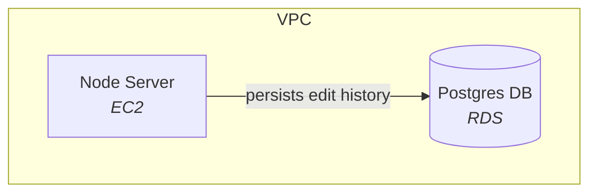

### Editorial Collaboration

This is a Node application written in TypeScript.

#### Setup
You will need Brew and Docker installed on your machine to run the setup script.

To set up, run the following command:
```bash
./scripts/setup
```

#### Start
To start, run the following command:
```bash
./scripts/start
```

#### Testing

Tests for the API are written using Jest. To run the tests, run the following command from the Collab directory:

```bash
npm run test
```

or for live updates

```bash
npm run test-watch
```

#### Architecture

The Node server runs on an EC2 instance. We persist edit history steps in an RDS managed Postgres database. 


