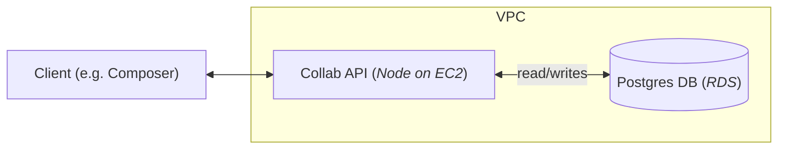

### Editorial Collaboration

This is a monorepo for a set of tools related to collaboration in the newsroom. 

It currently has one project (not in production), which will support displaying edit history and multi-user collaboration for a document.

The vision is it will be adopted into Composer (and perhaps other tools), improving the speed, efficiency and confidence in our text editors.

#### Local development
To run this locally you will need:

- Brew and Docker installed on your development machine
- AWS credentials for the Composer account.

Once you have these, run:

```bash
./scripts/setup
```

And then:
```bash
./scripts/start
```

#### Testing

Tests for the API are written using Jest. To run the tests, run the following command from the collab directory:

```bash
npm run test
```

Or for live updates:

```bash
npm run test-watch
```

#### Architecture & Technology

The API is a Node server running on an EC2 instance. We persist steps in an RDS managed Postgres database.


```mermaid
flowchart LR
    C["Client (e.g. Composer)"]
N["Collab API (<i>Node on EC2</i>)"]
P[("Postgres DB (<i>RDS</i>)")]
C<-->N
subgraph VPC
N <--read/writes--> P
end
```

We use [Prosemirror](https://prosemirror.net/) as our rich text editor, which has a plugin to support [collaborative editing](https://prosemirror.net/) in the browser.

For those new to Prosemirror and collaborative editing, here is some further reading/viewing, which may be of interest:

- [Intro to ProseMirror](https://marijnhaverbeke.nl/blog/prosemirror.html)
- [Collaborative Editing in ProseMirror](https://marijnhaverbeke.nl/blog/collaborative-editing.html)
- [Edit history spike – knowledge sharing recording](https://drive.google.com/file/d/1V8t8AtSMSJTIc-P7QbU4pwTh9lPL9dQg/view)
- [Slides from knowledge sharing recording](https://docs.google.com/presentation/d/15lVehN3EVA8ed2NqxF1Hz1s--E18h4QE8Wcf-zvgNE0)
